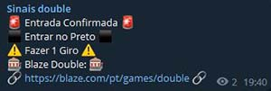
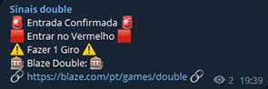

# Sala_Sinais_Double
<p align="justify">O bot_double é um programa Python que monitora o jogo Blaze Double e envia mensagens via Telegram com base em determinadas condições do jogo. Ele é projetado para automatizar a tomada de decisões durante o jogo e notificar o jogador sobre as ações necessárias.</p>

## Principais Funcionalidades:

- Monitoramento contínuo do estado do jogo Blaze Double.
- Envio de mensagens de notificação via Telegram.
- Detecção e tomada de decisões com base em condições específicas do jogo.
- Possibilidade de interromper a execução pressionando a tecla Espaço.

## 🛠️ Tecnologias Utilizadas
Principal tecnologia usada:</br>
**[Api Telegram](https://core.telegram.org/api)**</br>
**[Api Blaze](https://blaze.com/api/roulette_games/recent)**

## Licença
Este projeto é licenciado sob a licença MIT. Consulte o arquivo [LICENSE](LICENSE) para obter detalhes.

## 🚀 Instruções de Uso

### 📋 Instalação Das Dependências
Para instalar as dependências do projeto, execute o seguinte comando:
```bash
pip install -r requirements.txt
```

### Configuração do Token do Telegram:
Certifique-se de que o token do seu bot do Telegram esteja configurado corretamente. Você pode obter o token criando um bot no Telegram e obtendo o token de acesso.

```bash
# Após obter o token do seu bot, no arquivo bot_double.py adicionar seu token onde está escrito SEU_TOKEN_AQUI
if __name__ == '__main__':
    main('SEU_TOKEN_AQUI')
```

### Execução do Programa:
Execute o programa a partir do arquivo principal, mas não esqueça de instalar as dependências antes.

```bash
python bot_double.py
```

### Notificações via Telegram:
Com base nas condições do jogo, o programa enviará mensagens via Telegram para notificar o jogador, sendo as seguintes:

#### Mensagem que será enviada na sala de sinais quando a entrada for na cor preta:



#### Mensagem que será enviada na sala de sinais quando a entrada for na cor vermelha:

</br>

#### Mensagem que será enviada na sala de sinais quando houver vitória:

</br>

#### Mensagem que será enviada na sala de sinais quando houver perca:

</br>

### Interrupção da Execução:
Para interromper a execução do programa, pressione a tecla Espaço.